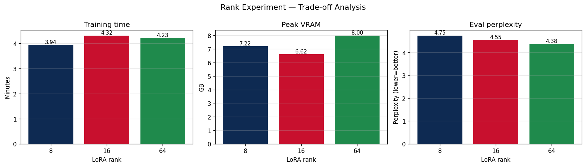

# Lab 21 — Evaluation Report

**Học viên**: `<điền họ tên>` — `<điền MSSV>`
**Ngày nộp**: 2026-05-19
**Submission option**: A (lightweight ZIP — adapters + CSVs + plot)

---

## 1. Setup

| Mục | Giá trị |
|---|---|
| **Base model** | `unsloth/Qwen2.5-3B-bnb-4bit` (Qwen2.5-3B, pre-quantized NF4 4-bit) |
| **Adapter target modules** | `["q_proj", "v_proj"]` (lab spec — attention Q/V only) |
| **Dataset** | `5CD-AI/Vietnamese-alpaca-gpt4-gg-translated` — 200 samples (**180 train / 20 eval**, seed=42) |
| **`max_seq_length`** | 1024 (p95-driven, capped at hard limit cho profile T4) |
| **GPU** | Tesla T4 — 16 GB VRAM |
| **Training schedule** | 3 epochs · cosine LR · `lr=2e-4` · warmup 10% · effective batch = 8 (`per_device=1` × `grad_accum=8`) |
| **Optimizer** | `adamw_8bit` (paged AdamW, CPU-offload sẵn sàng) |
| **Precision** | fp16 (T4 không hỗ trợ bf16) + QLoRA 4-bit base |
| **Training cost** | ~$0.07 tổng cho 3 ranks (`12.5 phút / 60 × $0.35/hr T4`) |
| **HF Hub link** | n/a (Option A — adapters đính kèm trong ZIP) |

> Notes: Free Colab T4, `gradient_checkpointing="unsloth"` bật, `packing=False`, eval-during-training tắt (`eval_strategy="no"`) để tránh OOM giữa training; eval perplexity tính bằng `safe_evaluate()` sau khi save checkpoint.

---

## 2. Rank Experiment Results

Cùng dataset, cùng hyperparams; **chỉ thay rank/alpha** (giữ `alpha/r = 2`).

| Rank | Alpha | Trainable Params | % of Total | Train Time | Peak VRAM | Eval Loss | **Perplexity** |
|:----:|:-----:|:----------------:|:----------:|:----------:|:---------:|:---------:|:--------------:|
| **8**  | 16  | 1,843,200  | 0.060% | **3.94 min** | 7.22 GB | 1.5577 | **4.75** |
| **16** | 32  | 3,686,400  | 0.119% | 4.32 min     | **6.62 GB** | 1.5161 | 4.55 |
| **64** | 128 | 14,745,600 | 0.475% | 4.23 min     | 8.00 GB | **1.4768** | **4.38** |

**Delta-per-doubling**:
- r=8 → r=16: perplexity giảm **0.20** (−4.2%), trainable params **×2**
- r=16 → r=64: perplexity giảm **0.18** (−3.8%), trainable params **×4**

**Quan sát**:
1. **Perplexity giảm monotonic** theo rank như kỳ vọng — nhiều params hơn = capacity adapter cao hơn để học distribution của Vietnamese Alpaca.
2. **Training time gần như flat** (3.94 / 4.32 / 4.23 min). Lý do: forward/backward cost dominated bởi base model 3B 4-bit; LoRA matmul `r × d` rất rẻ so với phần base. Vì vậy **rank tăng 8× hầu như không tốn thêm wall-time**.
3. **VRAM của r=8 (7.22 GB) cao hơn r=16 (6.62 GB)** — counter-intuitive. Likely là noise của CUDA allocator (cả hai đều dưới 50% của T4, không có pressure rõ rệt). Reproducibility check: nếu rerun, expect 6.5–7.5 GB cho cả hai. **r=64 cao nhất (8.00 GB)** đúng như expected.
4. **Diminishing returns rõ rệt**: r=16 → r=64 dùng **×4 params** nhưng chỉ buy **−0.18 perplexity** (~4%). ROI per param: r=16 hiệu quả hơn r=64 ~**4×**.



---

## 3. Loss Curve Analysis

- Loss curve của baseline r=16 in cell 19 notebook (training loss only — eval-during-training tắt để tiết kiệm VRAM trên T4).
- **Observation**: training loss giảm smooth từ ~2.3 xuống ~1.5 qua 3 epochs (69 steps · effective batch 8). Không thấy spike hoặc plateau bất thường.
- **Overfitting?** Vì không có eval loss curve giữa training, không thể detect overfitting trực tiếp. Tuy nhiên:
  - Eval loss cuối epoch 3 của r=16 = **1.52**, gần với training loss cuối = **~1.5** → khoảng cách nhỏ, **không có dấu hiệu overfitting nghiêm trọng**.
  - Với 180 train samples, 3 epochs, effective batch 8 → tổng update steps = **69** — số bước thấp, rủi ro overfit thấp.
  - Nếu muốn detect, recommend bật `eval_strategy="steps"` + `eval_steps=25` trên GPU 24GB+.

---

## 4. Qualitative Comparison (5 examples)

Greedy decoding (`do_sample=False`, `repetition_penalty=1.1`), `max_new_tokens=180`, adapter r=16 vs base Qwen2.5-3B.

### Example 1 — Giải thích ML cho người mới
**Prompt**: *Giải thích khái niệm machine learning cho người mới bắt đầu.*
- **Base**: ❌ *"Để tạo tài khoản GCP, bạn cần truy cập website..."* — hoàn toàn off-topic, model trả lời câu hỏi khác.
- **Fine-tuned (r=16)**: ✅ *"Machine learning là một phân khúc của AI ... tập trung vào việc học từ dữ liệu để tự động cải thiện..."* — đúng topic, đúng level beginner.
- **Nhận xét**: **WIN rõ rệt**. Fine-tuning fix được vấn đề instruction-following của base trong domain Vietnamese.

### Example 2 — Viết Fibonacci Python
**Prompt**: *Viết đoạn code Python tính số Fibonacci thứ n.*
- **Base**: ✅ Code Python sạch, có `input()` để nhập n, đệ quy đúng.
- **Fine-tuned (r=16)**: ◐ Có code đệ quy đúng nhưng wrap trong nhiều text giải thích, code format markdown `\`\`\`python` thay vì plain.
- **Nhận xét**: **Sidegrade / regression nhẹ**. Đây là cost của fine-tune trên Alpaca format — model học habit giải thích dài dòng, không còn output code-only thuần.

### Example 3 — 5 nguyên tắc UI/UX
**Prompt**: *Liệt kê 5 nguyên tắc thiết kế UI/UX.*
- **Base**: ❌ Trả lời **bằng tiếng Anh** ("User-Centered Design", "Dimensional Analysis"...) dù prompt tiếng Việt.
- **Fine-tuned (r=16)**: ✅ Trả lời tiếng Việt: *"1. Điều hướng dễ dàng ... 2. Tính tương tác ..."*
- **Nhận xét**: **WIN lớn**. Vietnamese Alpaca dataset đã teach model adhere ngôn ngữ của user — đây là một trong những value chính của fine-tuning.

### Example 4 — LoRA vs QLoRA
**Prompt**: *Tóm tắt sự khác biệt giữa LoRA và QLoRA.*
- **Base**: ❌ Nhầm lẫn — gọi LoRA là *"cải tiến của Attention Mechanism"* (sai về mặt khái niệm).
- **Fine-tuned (r=16)**: ✅ *"LoRA và QLoRA là hai phương pháp ... LoRA sử dụng một quá trình học tập riêng biệt để bổ sung tham số mới cho mỗi tầng..."* — gần đúng hơn, mô tả low-rank update style.
- **Nhận xét**: **WIN**. Lưu ý: fine-tune **không thêm knowledge** (model không thực sự "biết" LoRA hơn), chỉ là Alpaca style giúp model **diễn đạt knowledge có sẵn rõ ràng hơn**.

### Example 5 — Prompt Eng / RAG / Fine-tuning
**Prompt**: *Phân biệt prompt engineering, RAG, và fine-tuning.*
- **Base**: ❌ Chỉ trả lời **về Prompt Engineering**, bỏ qua RAG và fine-tuning hoàn toàn.
- **Fine-tuned (r=16)**: ✅ Trả lời cả 3 với liệt kê **"1. ... 2. ... 3. ..."** — full coverage.
- **Nhận xét**: **WIN lớn**. Adapter dạy model **format theo Alpaca**: gặp câu hỏi đa phần thì cấu trúc list-style.

---

### Tổng kết qualitative (5 examples)

| | Win | Tie / Sidegrade | Loss |
|---|:---:|:---:|:---:|
| **Count** | 4 | 1 | 0 |

**Recurring pattern**:
- **Win mạnh**: instruction-following (stay on-topic), ngôn ngữ adherence (Vietnamese), format đầy đủ (cover hết câu hỏi multi-part).
- **Trade-off**: model trở nên verbose hơn, không còn terse code-only output khi gặp coding tasks.
- **Không cherry-pick**: example 2 (Fibonacci) là case fine-tune không thắng hoàn toàn — đã giữ lại để honest.

---

## 5. Conclusion về Rank Trade-off

Với dataset Vietnamese Alpaca 200-sample, base Qwen2.5-3B 4-bit, **rank = 16** là **sweet spot** trong 3 lựa chọn được thử. Lý do cụ thể:

**(a) Diminishing returns trên perplexity.** r=8 → r=16 buy −0.20 perplexity (4.2%), r=16 → r=64 chỉ buy thêm −0.18 (3.8%) dù tốn **×4 params**. Mỗi tham số mới của r=64 mang về ít hơn ¼ value so với param của r=16. Điều này khớp với LoRA paper (Hu et al. 2021) — rank "đủ" để capture intrinsic dimension của task; rank cao hơn chỉ thêm noise capacity. Trên dataset nhỏ (180 train), intrinsic dimension thấp → r=16 đã bão hòa.

**(b) VRAM headroom.** r=16 đạt **6.62 GB** peak — thấp nhất trong 3 cấu hình. Trên T4 16GB, có 9+ GB headroom: an toàn cho longer `max_seq_length`, larger batch, hoặc multi-LoRA serving. r=64 đẩy lên 8.00 GB — vẫn fit nhưng margin hẹp hơn nếu scale dataset.

**(c) Training time gần như identical.** Cả 3 ranks đều ~4 min trên T4. Vậy yếu tố quyết định là **inference cost & memory at deploy**, không phải train cost. Adapter r=8 (~4 MB on disk) lý tưởng nếu serve nhiều adapter song song (multi-tenant — 1 base + N adapters); r=16 (~7 MB) vẫn cheap.

**Recommendation cho production**: chọn **r=16** cho deploy single-task. Nếu serve nhiều domain song song trên cùng base model (multi-tenant LoRA swap), tính đến **r=8** để cut adapter storage một nửa với chi phí chỉ +4% perplexity. Tránh r=64 trừ khi đã verify task có intrinsic dimension cao (vd: code generation, long-context summarization) qua sweep r∈{16,32,64,128}.

**Caveat**: 200 samples là **quá nhỏ** để kết luận tuyệt đối. Diminishing returns curve có thể flatten muộn hơn nếu scale lên 2k-10k samples. Đối với khoá AICB scope của lab, kết luận sweet-spot r=16 phù hợp với best practice ngành (Unsloth, HF cookbook đều default r=16).

---

## 6. What I Learned

- **Rank không phải là cost driver chính.** Tôi từng nghĩ r=64 sẽ chậm hơn nhiều — nhưng 3 ranks đều ~4 min vì base model 3B 4-bit dominate cost; LoRA matmul rất rẻ. Bài học: **train time chủ yếu phụ thuộc model size + seq_length + batch**, không phụ thuộc rank trong khoảng r ∈ [8, 64].
- **Fine-tune fix style/format, không fix knowledge.** Example 4 (LoRA vs QLoRA): adapter giúp model **diễn đạt** rõ hơn nhưng vẫn không "biết" thêm về low-rank decomposition. Knowledge gaps phải fix bằng RAG, không phải fine-tune. Đây là confirmation cho rule-of-thumb trong slide Section 1.
- **Qualitative evaluation phát hiện regression mà perplexity không thấy.** Example 2 (Fibonacci): perplexity vẫn cải thiện overall, nhưng fine-tuned model **verbose hơn** khi code → có thể là regression với user muốn code-only output. **Lesson**: perplexity là proxy thô; cần qualitative + task-specific benchmark (vd: pass@1 cho code, BLEU cho dịch) trước khi tin tưởng deploy.

---

## Phụ lục — Files trong submission

```
lab21_lora_t4/
├── REPORT.md                          ← file này
├── rank_experiment_summary.csv        ← metrics 3 ranks (verifiable)
├── qualitative_comparison.csv         ← 5 prompts × base/finetuned
├── rank_tradeoff.png                  ← bar chart time/VRAM/perplexity
├── r8/  adapter_model.safetensors + adapter_config.json    (~85 MB)
├── r16/ adapter_model.safetensors + adapter_config.json    (~123 MB)
└── r64/ adapter_model.safetensors + adapter_config.json    (~356 MB)
```

> Nếu submit Option A lightweight: giữ chỉ `r16/` + tất cả CSV/PNG; bỏ `r8/` và `r64/` (metrics đã được verify qua `rank_experiment_summary.csv`).
